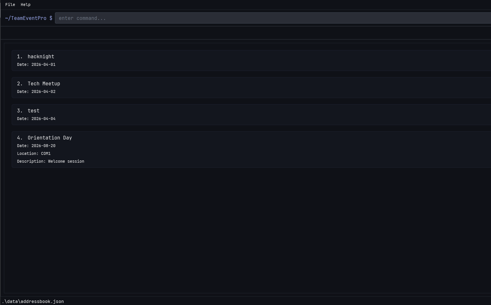

# TeamEventPro User Guide

## 1. About TeamEventPro

TeamEventPro is a desktop app for organizers who run recurring tech events, hackathons, and workshops. It is optimized for keyboard-first workflows, so common operations can be completed quickly during live event operations.

You can manage both event-level and participant-level work in one place. Outside an event, you can create, edit, search, and manage event records. Inside an event, you can add participants, update details, assign teams, check in attendees, filter/search lists, view statistics, and import or export CSV data.

TeamEventPro combines the speed of a Command Line Interface (CLI) with the visibility of a Graphical User Interface (GUI), making it suitable for organizers who need fast and accurate updates under time pressure.

---

## 2. Quick Start

1. Ensure you have Java `17` or above installed on your computer.

   - Mac users should ensure they are using the precise JDK version required for the project.

2. Download the latest `.jar` file from the project’s release page.

3. Copy the `.jar` file into the folder you want to use as the home folder for TeamEventPro.

4. Open a terminal, navigate to the folder containing the `.jar` file, and run:

   `java -jar addressbook.jar`

5. Wait a few seconds for the application window to open.

   You should see the main page shown below:

   

6. Type commands into the command box and press Enter to execute them.

7. An onboarding tutorial will begin when you open the application for the first time. Please go through that to familiarize
   yourself with the application.
---

## 3. Understanding App Modes

TeamEventPro has two main modes of use.

### 3.1 Outside an event

In this mode, you are viewing and managing the list of events.

You can use this mode to:
- create events
- edit event details
- delete events
- search for events
- enter a specific event

### 3.2 Inside an event

In this mode, you are managing participants within a selected event.

You can use this mode to:
- add, edit, and delete participants
- assign participants to teams
- check in participants
- filter and view participant details
- view event statistics
- import and export participant data
- leave the current event and return to the event list

---

## 4. Notes About Command Format

- Words in `UPPER_CASE` are parameters to be supplied by the user.
- Items in square brackets are optional.
- Items followed by `...` can be used multiple times.
- Parameters can usually be entered in any order unless stated otherwise.
- Indexes refer to the numbers shown in the displayed list.
- Dates should follow the format `YYYY-MM-DD`.

---

## 5. Commands Available in Both Modes

The following commands can be used regardless of whether you are inside or outside an event:

- `help`
- `list`
- `search`
- `switchmode`

Full details for these commands are in [Common Commands](UserGuideCommonCommands.md).

---

## 6. Next Sections

- [Common Commands](UserGuideCommonCommands.md)
- [Event Commands](UserGuideEvents.md)
- [Participant Commands](UserGuideParticipants.md)
