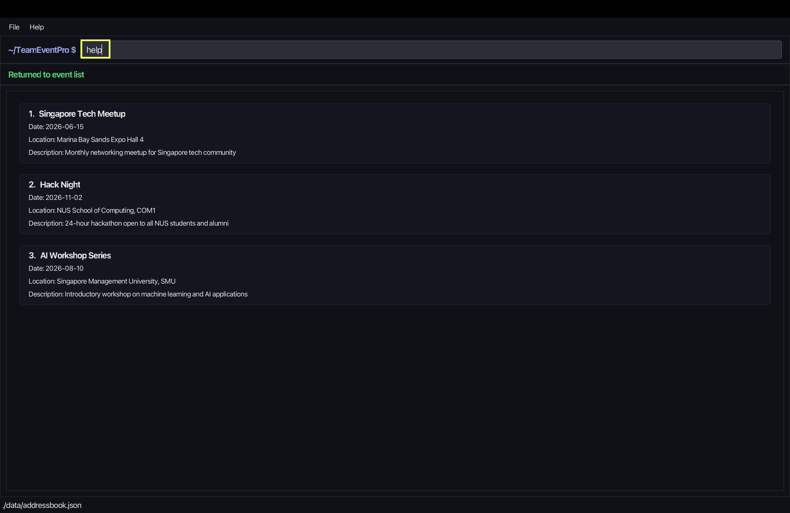

# Common Commands

This page describes commands that are available in both app modes.

---

## 1. Commands Available in Both Modes

The following commands can be used regardless of whether you are inside or outside an event:

- `help`
- `list`
- `search`
- `switchmode`

---

## 2. Help command

Used to open the help window and view usage instructions.

### Format
`help`

### Example Usage
```
help
```


### Successful Execution
Opens a new window containing the User Guide link.


### Notes
- Can be used in any mode.

---

## 3. List command

Used to list all events or all participants depending on the current mode.

### Format
`list`

### Example Usage
`list`

### Successful Execution
- Outside an event: `Listed all events`
- Inside an event: `Listed all participants`

### Notes
- Works differently depending on the current mode.

---

## 4. Search command

Used to search for matching events or participants depending on the current mode.

### Format
`search [KEYWORD]...`

### Example Usage
`search meetup workshop`

### Successful Execution
- Outside an event: matching events are shown in the event list.
- Inside an event: matching participants are shown in the participant list.

### Notes
- Can be used in any mode.
- The results depend on the current mode.

---

## 5. Switch Mode command

Used to switch the application theme.

### Format
`switchmode [dark|light]`

### Example Usage
`switchmode dark`

### Successful Execution
`Switched to dark mode.`

### Notes
- Can be used in any mode.
- Only `dark` and `light` are valid values.

---

## 6. Navigation

- [Back to Introduction and App Modes](UG.md)
- [Go to Event Commands](UserGuideEvents.md)
- [Go to Participant Commands](UserGuideParticipants.md)
