# Participant Commands

This page describes commands that are used while you are inside an event and managing that event's participants.

See [Command Fundamentals](UserGuideCommandFundamentals.md) for command syntax, prefix rules, index behavior, and common input mistakes.

---

## 1. Participant Management

### 1.1 Add command

Used to add a participant to the currently entered event.

#### Format
`add n/[NAME] p/[PHONE] e/[EMAIL] a/[ADDRESS] [tm/TEAM] [g/GITHUB_USERNAME] [r/RSVP_STATUS] [t/TAG]...`

#### Example Usage
`add n/John Doe p/98765432 e/johnd@example.com a/311, Clementi Ave 2, #02-25 tm/Development g/johndoe r/yes t/friends`


#### Successful Execution
`New applicant added: ...`


#### Notes
- Can only be used inside an event.
- Name, phone, email, and address are required.
- `NAME` can contain alphanumeric characters (including accented characters e.g. José, Tomáš), spaces, apostrophes (`'`), hyphens (`-`), and forward slashes (`/`) e.g. `O'Brian`, `s/o Kumar`. Names cannot exceed 100 characters.
- `RSVP_STATUS` must be `yes`, `no`, or `pending` (case-insensitive). Defaults to `pending` if not provided.
- `TEAM` must be alphanumeric and at most 15 characters.
- Two participants are considered duplicates if they share the same name and either the same phone number or the same email. Duplicate participants cannot be added to the same event.

### 1.2 Edit command

Used to edit the details of an existing participant in the current event.

#### Format
`edit [INDEX] [n/NAME] [p/PHONE] [e/EMAIL] [a/ADDRESS] [g/GITHUB_USERNAME] [r/RSVP_STATUS] [tm/TEAM] [t/TAG]...`

#### Example Usage
`edit 1 p/91234567 e/johndoe@example.com`
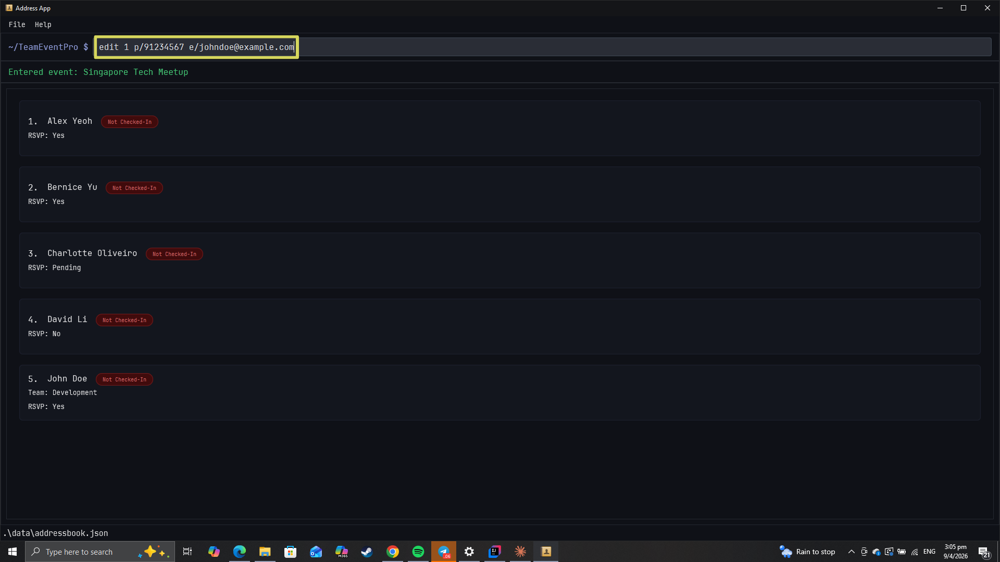

#### Successful Execution
`Edited Applicant: ...`
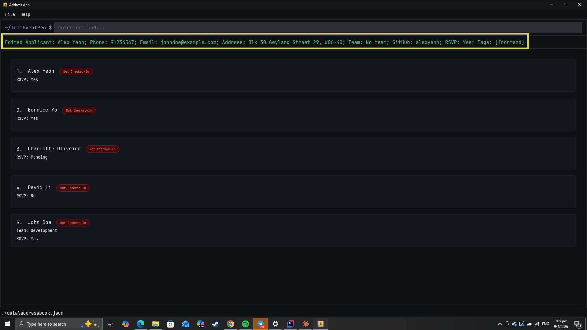

#### Notes
- Can only be used inside an event.
- Index must be a positive integer.
- At least one field to edit must be provided.
- Existing values will be overwritten by the new values.
- `NAME` follows the same constraints as the `add` command — alphanumeric characters (including accented), spaces, apostrophes, hyphens, and forward slashes. Cannot exceed 100 characters.
- `RSVP_STATUS` must be `yes`, `no`, or `pending` (case-insensitive).
- `TEAM` must be alphanumeric and at most 15 characters.
- Clear all tags by typing `t/` with nothing after it.
- Clear the team by typing `tm/` with nothing after it.
- Editing a participant to match another participant's name and phone or email will be rejected as a duplicate.

### 1.3 Delete command

Used to delete a participant from the current event.

#### Format
`delete [INDEX]`

#### Example Usage
```text
delete 1
```
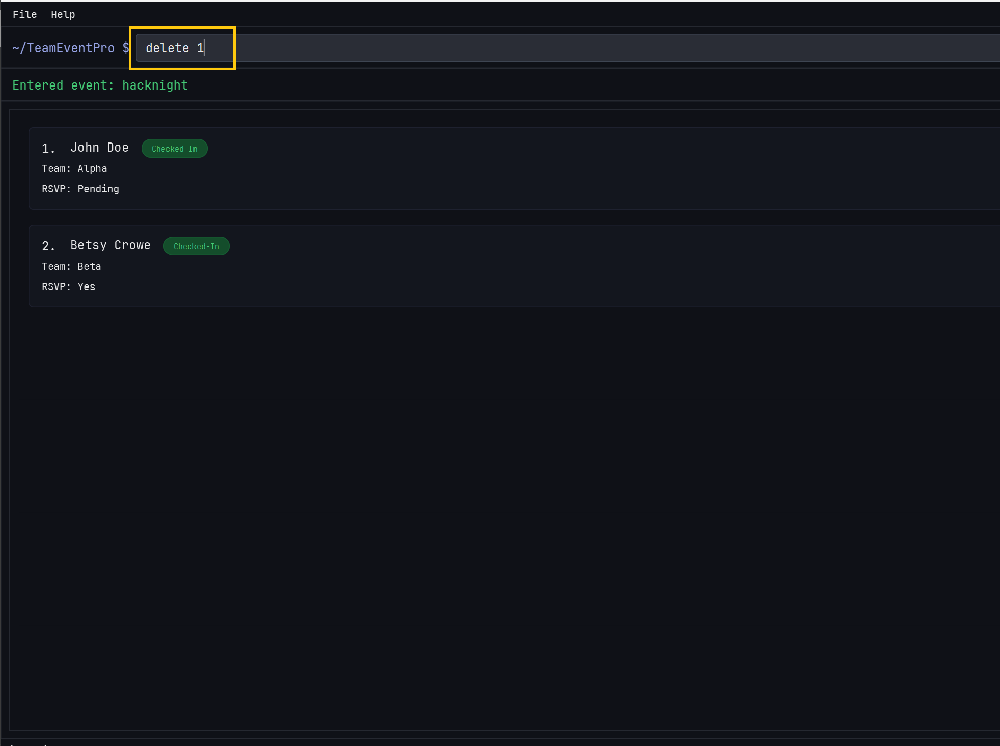

#### Successful Execution
`Deleted Participant: ...`


#### Notes
- Can only be used inside an event.
- Index must be a positive integer.

### 1.4 Clear command

Used to clear all participants from the current event.

#### Format
`clear`

#### Example Usage
```text
clear
```
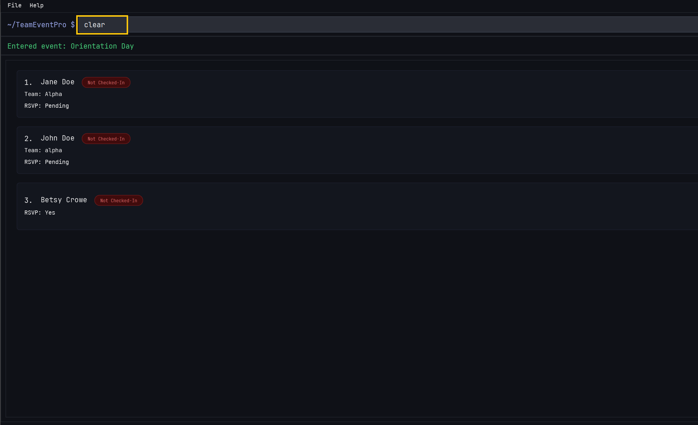

#### Successful Execution
`Address book has been cleared!`


#### Notes
- Can only be used inside an event.
- This removes all participants from the current event.

---

## 2. Team and Attendance Management

### 2.1 Assign Team command

Used to assign a participant to a team.

#### Format
`assign [INDEX] team/[TEAM NAME]`

#### Example Usage
```
assign 2 team/Alpha
```


#### Successful Execution
`Assigned [participant] to Team Alpha.`


#### Notes
- Can only be used inside an event.
- Index must be a positive integer.
- Team names must be alphanumeric and at most 15 characters.

### 2.2 Check-In command

Used to mark a participant as checked in.

#### Format
`checkin [INDEX]`

#### Example Usage
```
checkin 3
```
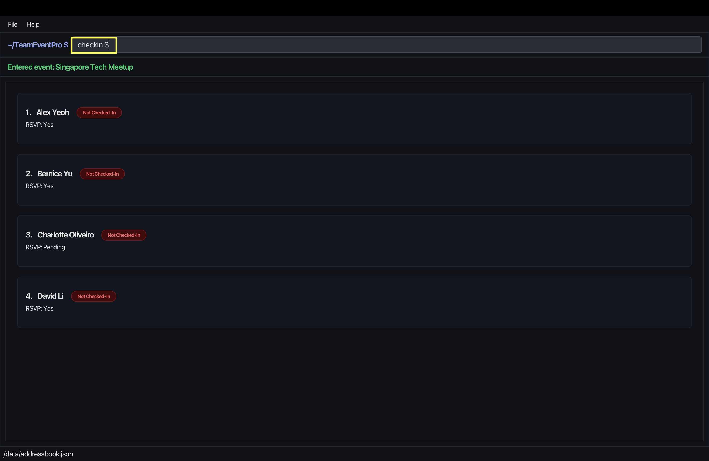

#### Successful Execution

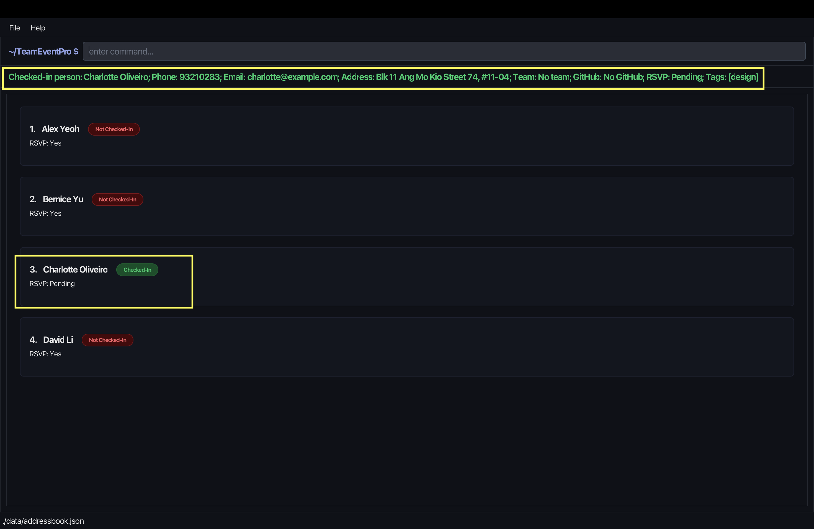

#### Notes
- Can only be used inside an event.
- Index must be a positive integer.

---

## 3. Search, Filtering, and Viewing

### 3.1 Filter command

Used to filter the participant list using one criterion at a time.

#### Format
<tabs>
<tab header="RSVP">

`filter r/[RSVP_STATUS]`

</tab>
<tab header="Tag">

`filter t/[TAG]`

</tab>
<tab header="Team">

`filter team/[TEAM NAME]`

</tab>
<tab header="Check-in">

`filter checkin/[yes|no]`

</tab>
</tabs>

#### Example Usage
<tabs>
<tab header="RSVP">

```
filter r/yes
```


</tab>
<tab header="Tag">

```
filter t/python
```


</tab>
<tab header="Team">

```
filter team/Alpha
```


</tab>
<tab header="Check-in">

```
filter checkin/yes
```
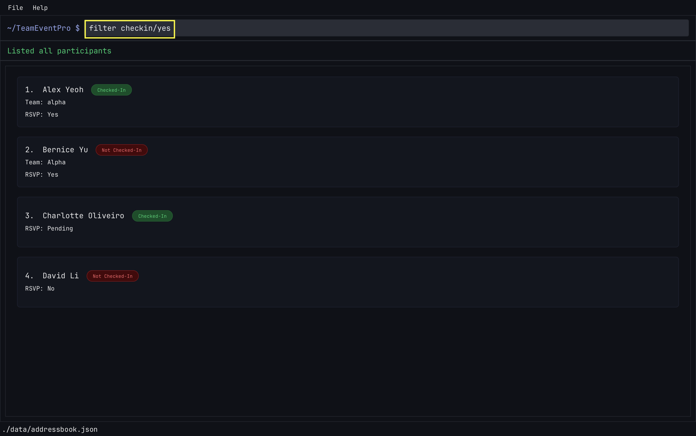

</tab>
</tabs>

#### Successful Execution
<tabs>
<tab header="RSVP">


</tab>
<tab header="Tag">


</tab>
<tab header="Team">


</tab>
<tab header="Check-in">


</tab>
</tabs>

#### Notes
- Can only be used inside an event.
- Supported prefixes are `r/`, `t/`, `team/`, and `checkin/`.
- Only one filter criterion can be used per command (e.g., `filter r/yes t/python` is invalid).
- Filtering is not cumulative across commands; each `filter` command replaces the previous filter/search.
- `checkin/` accepts `yes` or `no`(case-insensitive).

### 3.2 View command

Used to show the details of a selected participant.

#### Format
```
view [INDEX]
```

#### Example Usage
```
view 1
```


#### Successful Execution


#### Notes
- This command can only be used inside an event.
- `INDEX` must be a positive integer.
- The `INDEX` must refer to a participant currently shown in the displayed list, including filtered or searched results.
- The command fails if the `INDEX` is invalid or out of range.

### 3.3 Statistics command

Used to display the current event's participant statistics summary.

#### Format
```
statistics
```

#### Example Usage
```
statistics
```


#### Successful Execution


#### Notes
- Can only be used inside an event.
- This is a read-only command; it does not edit participant data.
- If you want to return to normal participant list operations, use commands like `list`, `filter`, `search`, etc.
- The command format is `statistics` only (no index or prefixes needed).

---

## 4. Import and Export

### 4.1 Import command

Used to import participants from a CSV file into the current event.

#### Format
`import [FILE_PATH]`
`import list`

#### Example Usage
```text
import data/participants.csv
```


To list discoverable CSV files:

```text
import list
```
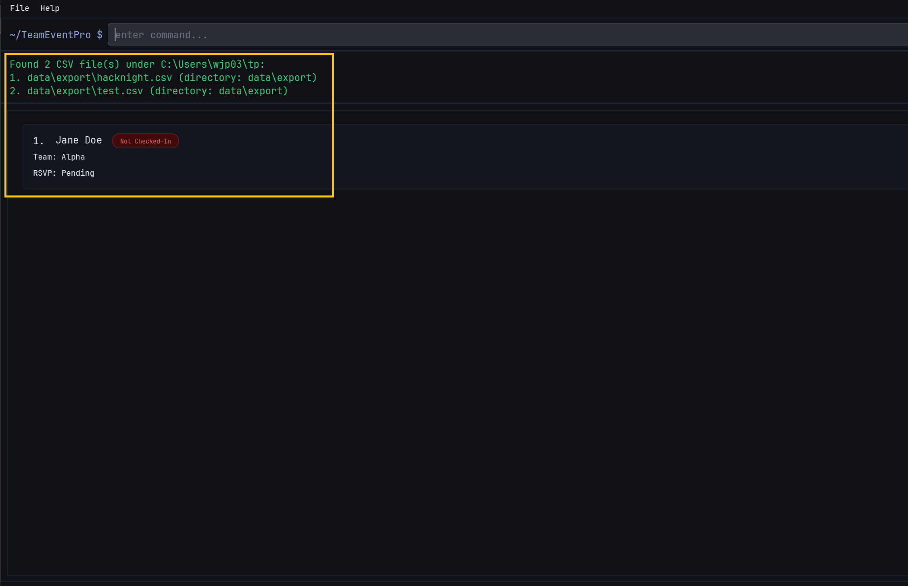

#### Successful Execution
Participants from the CSV file are imported into the current event. Invalid rows and duplicates are skipped and reported.


#### Notes
- Can only be used inside an event.
- Only `.csv` files are supported.
- `import list` shows discoverable CSV files.
- Required CSV headers are `name`, `phone`, `email`, and `address`.

### 4.2 Export command

Used to export participants from the current event to a CSV file.

#### Format
`export [FILE_PATH]`

#### Example Usage
```text
export data/exports/team-event.csv
```
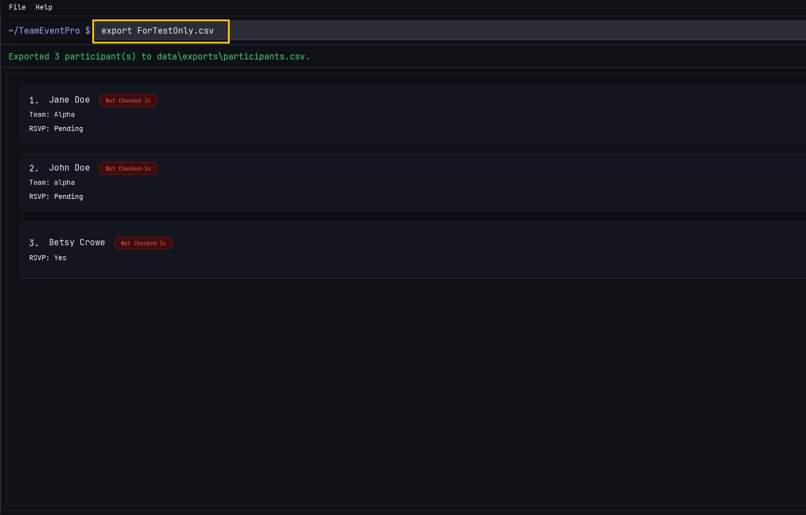

To export using the default path:

```text
export
```


#### Successful Execution
`Exported ... participant(s) to ...`

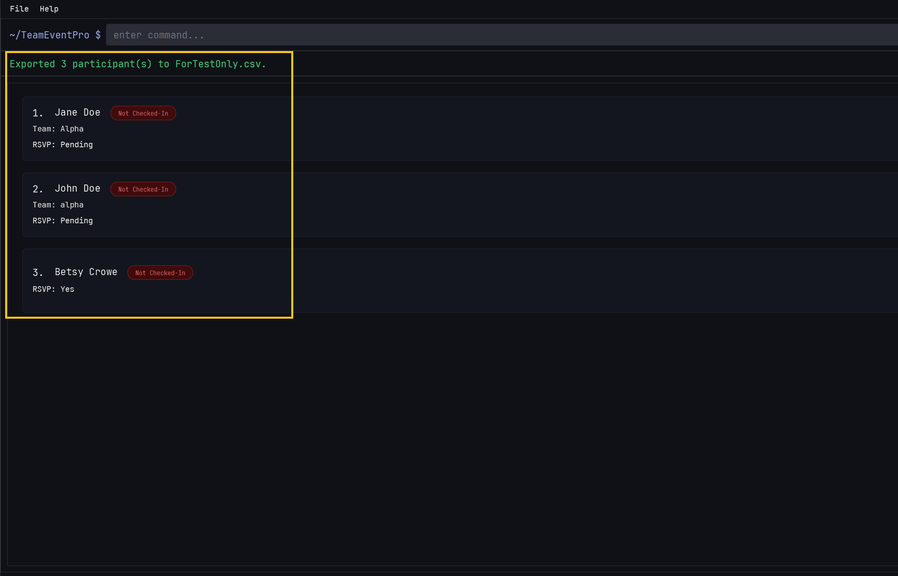

Default-path export result:

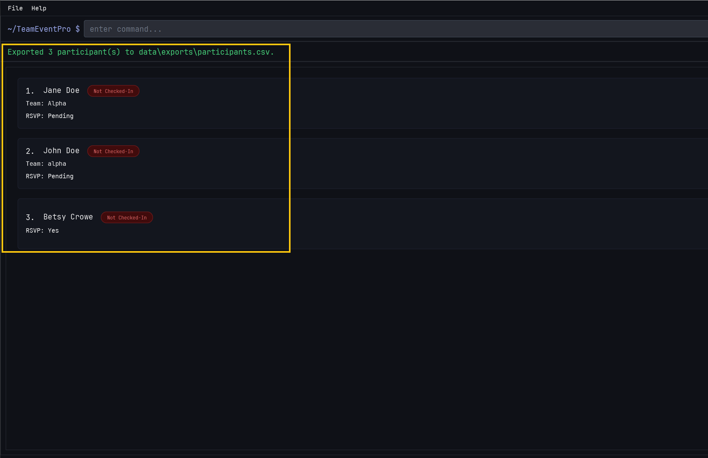

#### Notes
- Can only be used inside an event.
- Only `.csv` files are supported.
- If no file path is provided, the default export path is used.
- If the target file already exists, the app exports to a timestamped file instead.

---

## 5. Event Navigation

### 5.1 Leave Event command

Used to leave the current event and return to the event list.

#### Format
`leave event`

#### Example Usage
```
leave event
```
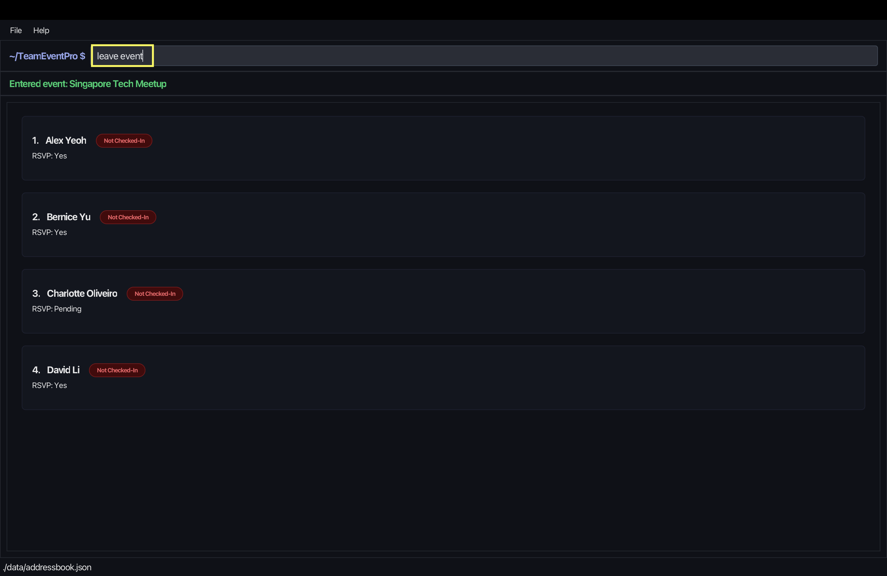

#### Successful Execution

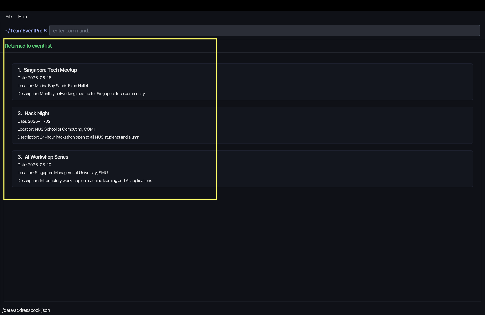

#### Notes
- Can only be used inside an event.
- Ensure that there is no space after `event`.

---

## 6. Navigation

- [Back to Introduction, Modes, and Common Commands](UG.md)
- [Back to Common Commands](UserGuideCommonCommands.md)
- [Back to Command Fundamentals](UserGuideCommandFundamentals.md)
- [Back to Event Commands](UserGuideEvents.md)
