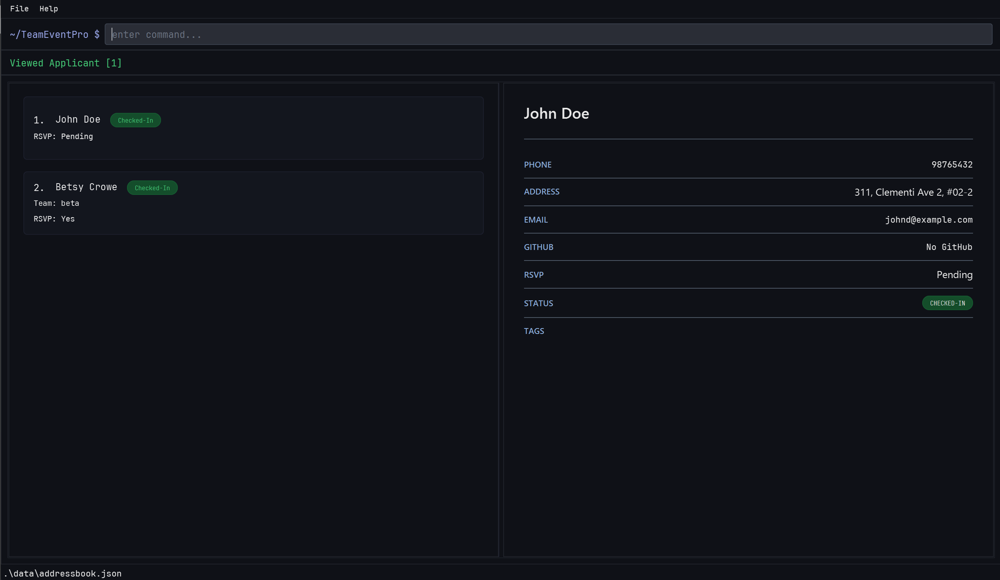

# TeamEventPro

**TeamEventPro is a desktop application for managing tech events and participants.** While it has a GUI, most interactions are optimized for a CLI (Command Line Interface) workflow.

* If you are interested in using TeamEventPro, head over to the [_Quick Start_ section of the **User Guide**](UG.html#2-quick-start).
* If you are interested in developing TeamEventPro, the [**Developer Guide**](DeveloperGuide.html) is a good place to start.

**Acknowledgements**

* Libraries used: [JavaFX](https://openjfx.io/), [Jackson](https://github.com/FasterXML/jackson), [JUnit5](https://github.com/junit-team/junit5)
